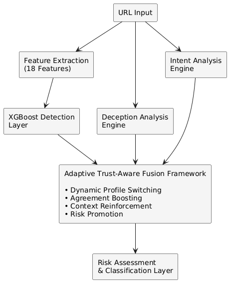
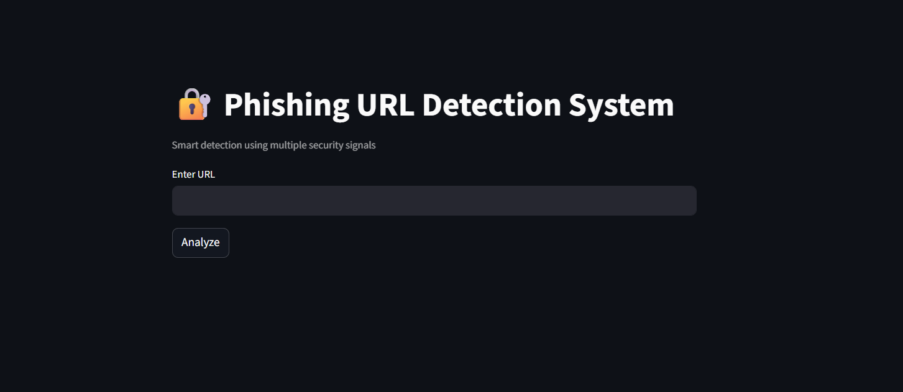
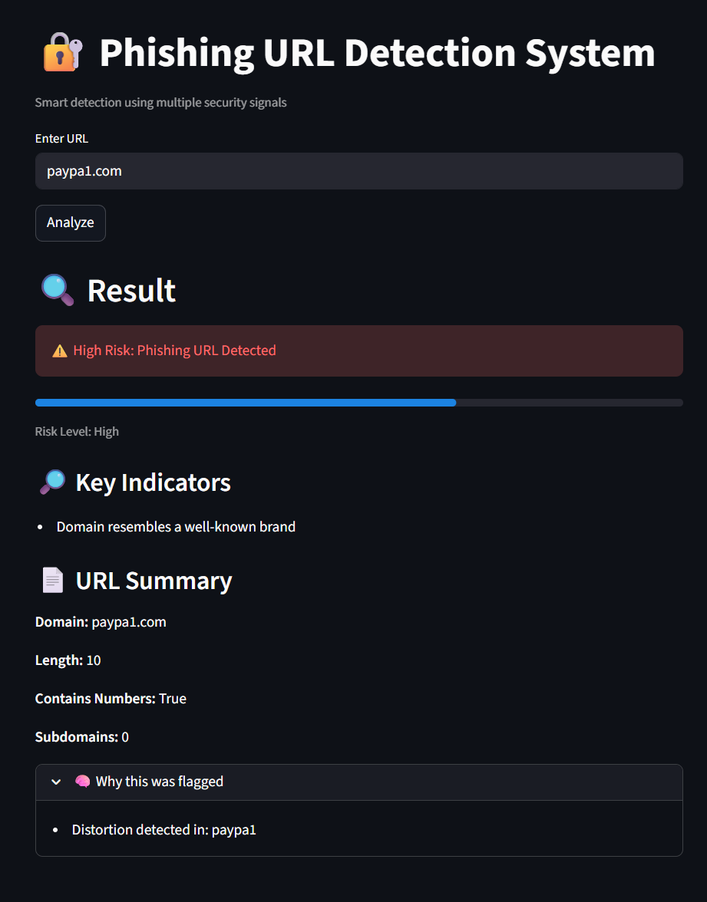
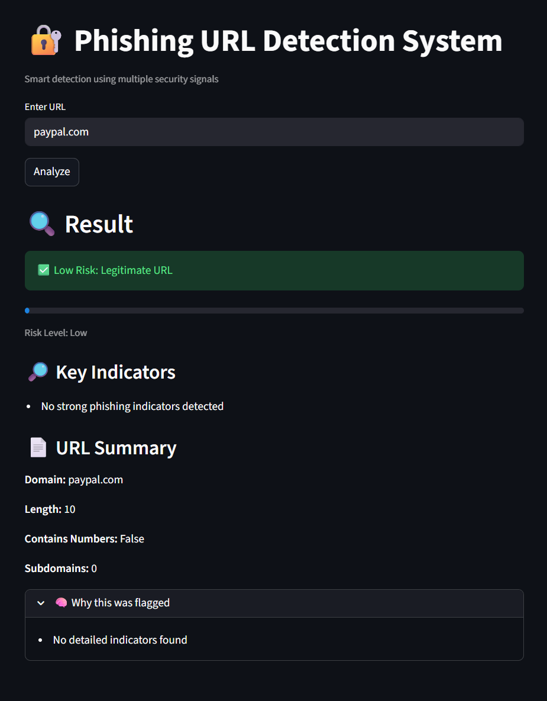

# Adaptive Phishing URL Detection Framework

An intelligent phishing URL detection system that combines **Machine Learning**, **Deception Analysis**, **Intent Analysis**, and an **Adaptive Trust-Aware Fusion Engine** to identify sophisticated phishing attacks beyond traditional URL classifiers.

Traditional phishing detection systems rely heavily on machine learning predictions alone. This project introduces a multi-layered security intelligence framework that evaluates URLs using independent security signals and dynamically adapts trust allocation based on detected attack characteristics.

---

## Project Highlights

* Trained on **1.49 Million URLs**
* **XGBoost-based** phishing detection model
* **98.96% Accuracy** on the test dataset
* **18 Engineered URL Security Features**
* Advanced **Deception Analysis Engine**
* Phishing-oriented **Intent Analysis Engine**
* Adaptive **Trust-Aware Risk Fusion Framework**
* Interactive **Streamlit Web Application**
* Explainable phishing risk assessment

---

## Overview

Phishing attacks have evolved far beyond simple malicious URLs and increasingly employ techniques such as:

* Domain spoofing
* Character substitution
* Homograph attacks
* Deceptive branding
* Unicode manipulation
* Phishing-oriented intent signals

These techniques often bypass traditional URL classification systems.

This framework addresses the problem by integrating multiple security intelligence layers:

1. Machine Learning Detection Layer
2. Deception Analysis Layer
3. Intent Analysis Layer
4. Adaptive Trust-Aware Fusion Framework
5. Risk Assessment and Explanation Layer

The system evaluates URLs using independent risk signals and combines them into a unified phishing risk score for more robust detection.

---

## Key Features

### Machine Learning Detection Layer

* XGBoost-based phishing URL classifier
* Trained on approximately 1.49 million URLs
* Uses 18 engineered lexical, structural, statistical, and security-related features
* Generates phishing probability scores

### Deception Analysis Engine

Detects advanced URL manipulation techniques including:

* Character substitution attacks
* Homograph attacks
* Unicode anomalies
* Punycode abuse
* Repeated-character manipulation
* Domain deception patterns

### Intent Analysis Engine

Identifies phishing-oriented intent through:

* Suspicious keyword detection
* Risk-based keyword scoring
* Multi-keyword threat assessment
* Nonlinear intent escalation

### Adaptive Trust-Aware Fusion Framework

Combines:

* Machine Learning Risk
* Deception Risk
* Intent Risk

into a unified phishing risk score.

The framework incorporates:

* Dynamic profile switching
* Agreement boosting
* Context reinforcement
* Nonlinear risk fusion
* Adaptive risk promotion

### Explainable Risk Assessment

Provides:

* Final classification result
* Risk level indication
* Detection explanations
* URL summary information
* Key phishing indicators

---

## Dataset

The machine learning model was trained using a large-scale URL dataset compiled from multiple sources.

### Data Sources

* PhishTank
* Tranco
* Additional Benign URL Sources

### Dataset Statistics

| Metric           | Value     |
| ---------------- | --------- |
| Total URLs       | 1,489,337 |
| Training Samples | 1,191,469 |
| Testing Samples  | 297,868   |

---

## Engineered Feature Set

The framework extracts 18 handcrafted URL features categorized into four groups.

### Lexical Features

* Character counts
* Token statistics
* URL composition metrics

### Structural Features

* Domain characteristics
* Subdomain characteristics
* TLD analysis

### Statistical Features

* Character entropy
* Digit ratio
* Uppercase ratio
* Vowel ratio

### Security Features

* HTTPS usage
* Suspicious keyword indicators

---

## How It Works

1. User submits a URL through the Streamlit interface.
2. The Feature Extraction Module generates 18 security-related features.
3. The XGBoost model predicts phishing probability.
4. The Deception Analysis Engine evaluates manipulation patterns.
5. The Intent Analysis Engine assesses phishing-oriented intent signals.
6. The Adaptive Trust-Aware Fusion Framework combines multiple risk signals.
7. The Risk Assessment Layer generates the final classification and explanation.

---

## System Architecture



---

## Repository Structure

```text
adaptive-phishing-url-detection-framework
│
├── docs/
│   └── architecture.png
│
├── models/
│   ├── xgb_model.pkl
│   └── probability_calibrator.pkl
│
├── screenshots/
│   ├── home_page.png
│   ├── phishing_url_result.png
│   └── legitimate_url_result.png
│
├── src/
│   ├── streamlit_app.py
│   ├── feature_extraction.py
│   ├── deception_analysis_engine.py
│   └── intent_analysis_engine.py
│
├── requirements.txt
├── LICENSE
└── README.md
```

---

## Application Screenshots

### Home Interface



### Phishing Detection Example



### Legitimate URL Example



---

## Performance

Performance results were obtained using the XGBoost phishing detection model on the held-out test dataset.

| Metric    | Value  |
| --------- | ------ |
| Accuracy  | 98.96% |
| Precision | 83.00% |
| Recall    | 93.95% |
| F1 Score  | 88.13% |

---

## Technology Stack

### Programming Language

* Python

### Machine Learning

* XGBoost
* Scikit-Learn

### Data Processing

* Pandas
* NumPy

### URL Analysis

* tldextract

### Web Application

* Streamlit

---

## Installation

### Clone Repository

```bash
git clone https://github.com/AdityaPansare1408/adaptive-phishing-url-detection-framework.git
```

### Navigate to Project Directory

```bash
cd adaptive-phishing-url-detection-framework
```

### Install Dependencies

```bash
pip install -r requirements.txt
```

### Run Application

```bash
streamlit run src/streamlit_app.py
```

---

## Future Enhancements

* Browser extension deployment
* Real-time domain reputation lookup
* Threat intelligence integration
* Deep learning-based URL analysis
* Cloud deployment
* Real-time URL monitoring
* Explainable AI integration for prediction transparency

---

## License

This project is licensed under the MIT License.

See the [LICENSE](LICENSE) file for details.

---

## Author

**Aditya Pansare**

M.Tech Computer Engineering
Pune Institute of Computer Technology (PICT)

---

## Keywords

Cybersecurity • Phishing Detection • URL Classification • Machine Learning • XGBoost • Streamlit • Threat Detection • Trust-Aware Security • Deception Analysis • Intent Analysis
